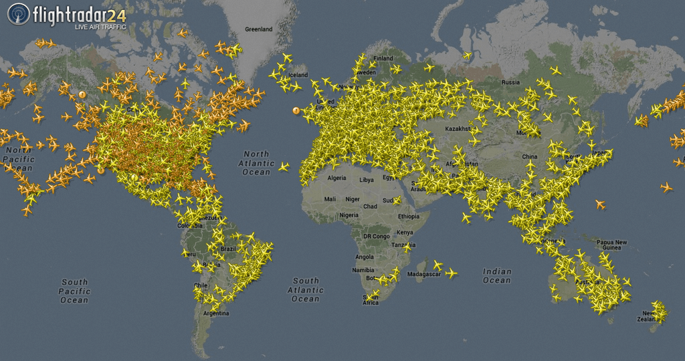

# FlightRadar24

# Sujet

Créer un pipeline ETL (Extract, Transform, Load) permettant de traiter les données de l'API [flightradar24](https://www.flightradar24.com/), qui répertorie l'ensemble des vols aériens, aéroports, compagnies aériennes mondiales.

> En python, cette librairie: https://github.com/JeanExtreme002/FlightRadarAPI facilite l'utilisation de l'API.

## Résultats

Ce pipeline doit permettre de fournir les indicateurs suivants:
1. La compagnie avec le + de vols en cours
2. Pour chaque continent, la compagnie avec le + de vols régionaux actifs (continent d'origine == continent de destination)
3. Le vol en cours avec le trajet le plus long
4. Pour chaque continent, la longueur de vol moyenne
5. L'entreprise constructeur d'avions avec le plus de vols actifs
6. Pour chaque pays de compagnie aérienne, le top 3 des modèles d'avion en usage

## Industrialisation

Ce kata est orienté **industrialisation**. Le pipeline ETL doit être pensé comme un job se faisant éxécuter à échéance régulière (ex: toutes les 2 heures).

Le job doit donc être
* **fault-tolerant**: Un corner-case pas couvert ou une donnée corrompue ne doivent pas causer l'arret du job.
* **observable**: En loggant les informations pertinantes
* **systématique**: conserver les données & résultats dans un mécanisme de stockage, en adoptant une nomencalture adaptée permettant aux _data analyst_ en aval de retrouver les valeurs recherchées pour un couple `(Date, Heure)` donné.

## ⚠️ Candidatures ⚠️

> Le kata laisse volontairement beaucoup de liberté. Il y a une grande marge de progression entre un “MVP” et une implémentation “parfaite”. Au candidat de choisir sur quelles exigences mettre le focus dans son rendu.

> Le rendu MVP implémente au moins 4 des questions de l'énoncé, assorti d'un Readme expliquant la démarche choisie

> A défaut d'implémenter tout le pipeline, proposez dans le README **un exemple d'architecture idéal de votre application industrialisée**(dans un environnement de PROD) sans avoir besoin de l'implémenter (ex: ordonnancement, monitoring, data modeling, etc.)

> Pour faire ce schéma, https://www.diagrams.net/ ou https://excalidraw.com/ sont vos amis :)

> **Pour le rendu, Poussez sur une nouvelle branche git, ouvrez une merge request vers Main, et notifiez votre interlocuteur par message que le kata est fini.

# Contexte & motivation derrière le kata

Un data engineer doit être capable de concevoir un pipeline de données pour gérer un flux important et en tirer des informations pertinentes. 

 

En tant que data engineer, il est important de pouvoir **explorer & comprendre le dataset qu’on manipule** pour proposer les Vues adaptées au différents use-cases, et effectuer le data-cleaning nécessaire. 

https://www.flightradar24.com/ est une API fournissant des informations **en temps réel** sur le traffic aérien mondial. De ce fait, les informations qu'elle renvoie changent en parmanence. Pour en tirer des informations utiles, son traitement doit donc **doit être répété régulièrement**. Pour des raisons d'efficacité, on cherche donc à transformer ce pipeline ETL en **un job ne requérant pas d'intervention humaine.**

# Specification [RFC2119](https://microformats.org/wiki/rfc-2119-fr) du kata

* Un grand pouvoir implique de grandes responsabilités. Vos choix `DOIVENT` être justifiés dans un Readme. 

* L'extraction des données `PEUT` être faite dans le format de votre choix. CSV, Parquet, AVRO, ... celui qu'il vous semble le plus adapté

* Votre pipeline `DOIT` inclure une phase de [data cleaning](https://fr.wikipedia.org/wiki/Nettoyage_de_donn%C3%A9es)

* Le rendu `PEUT` comporter un Jupyter notebook avec les résultats

* votre pipeline `DEVRAIT` utiliser Apache Spark et l'API DataFrame

* votre pipeline `DEVRAIT` stocker les données dans un dossier avec une nomenclature horodatée. Ex: `Flights/rawzone/tech_year=2023/tech_month=2023-07/tech_day=2023-07-16/flights2023071619203001.csv`

> Questions Bonus: Quel aéroport a la plus grande différence entre le nombre de vol sortant et le nombre de vols entrants ?
